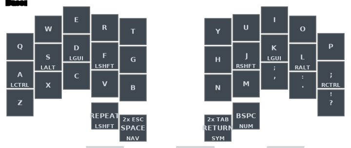

# Zyraft

```text
███████╗██╗   ██╗██████╗  █████╗ ███████╗████████╗
╚══███╔╝╚██╗ ██╔╝██╔══██╗██╔══██╗██╔════╝╚══██╔══╝
  ███╔╝  ╚████╔╝ ██████╔╝███████║█████╗     ██║
 ███╔╝    ╚██╔╝  ██╔══██╗██╔══██║██╔══╝     ██║
███████╗   ██║   ██║  ██║██║  ██║██║        ██║
╚══════╝   ╚═╝   ╚═╝  ╚═╝╚═╝  ╚═╝╚═╝        ╚═╝
```

ZMK firmware for a 34-key Ferris-style wireless split with a dedicated XIAO BLE dongle and Prospector display.



## Key ideas

- QWERTY alphas with symmetric GACS home-row mods.
- Seven layers: Base, Nav, Fn, Num, Sym, Mouse, and Sys.
- Four multi-function thumbs for Shift, Space/NAV, Return/SYM, and Backspace/NUM.
- 39 combos for editing, symbols, modes, and layer access.
- Leader sequences for German characters, the Greek alphabet, and device commands.
- Clipboard and application switching adapt to Windows, macOS, or Linux.
- Prebuilt firmware for the dongle, both halves, and both controller reset targets.

## Layer access

| Layer | Access |
|---|---|
| Base | default |
| Nav | hold Space |
| Fn | toggle from Nav |
| Num | hold Backspace or use Number Word |
| Sym | hold Return or use `O+P` |
| Mouse | `E+R` combo |
| Sys | three-thumb combo or Fn toggle |

## Firmware

| File | Target |
|---|---|
| [`zyraft_dongle.uf2`](firmware/zyraft_dongle.uf2) | XIAO BLE dongle with Prospector and ZMK Studio |
| [`zyraft_dongle_nostudio.uf2`](firmware/zyraft_dongle_nostudio.uf2) | XIAO BLE dongle without Studio |
| [`zyraft_left.uf2`](firmware/zyraft_left.uf2) | left nice!nano peripheral |
| [`zyraft_right.uf2`](firmware/zyraft_right.uf2) | right nice!nano peripheral |
| [`settings_reset_xiao.uf2`](firmware/settings_reset_xiao.uf2) | XIAO settings recovery |
| [`settings_reset.uf2`](firmware/settings_reset.uf2) | nice!nano settings recovery |

Reset images are recovery tools for stale pairings/settings. They are not part of a normal firmware update.

## Documentation

- [Layers and keymap](docs/keymap.md)
- [Hold-taps, home-row mods, and smart behaviors](docs/behaviors.md)
- [All combos](docs/combos.md)
- [Leader sequences](docs/leader.md)
- [Build and flash](docs/build-and-flash.md)

## Quick local build

```bash
python3 -m venv .venv
.venv/bin/python -m pip install -r requirements-dev.txt
.venv/bin/west init -l config
.venv/bin/west update
./build.sh all
```

See [Build and flash](docs/build-and-flash.md) for individual targets, diagram generation, and settings reset.

## Repository structure

```text
config/                 ZMK keymap, behaviors, shield, and west manifest
config/keymap/          focused behavior, combo, leader, mouse, and OS files
docs/                   keymap reference and generated diagrams
firmware/               prebuilt UF2 files
scripts/draw-keymap.sh  regenerate/check diagrams
build.sh                local firmware build targets
build.yaml              GitHub Actions build matrix
```

## Credits

Built on [ZMK](https://zmk.dev/) and [keymap-drawer](https://github.com/caksoylar/keymap-drawer). The documentation structure takes visual inspiration from [alvaro-prieto/corne](https://github.com/alvaro-prieto/corne), adapted to Zyraft's actual ZMK behaviors and hardware.
