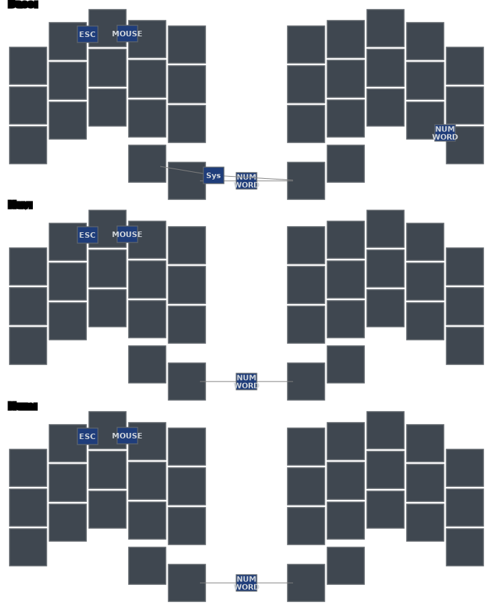
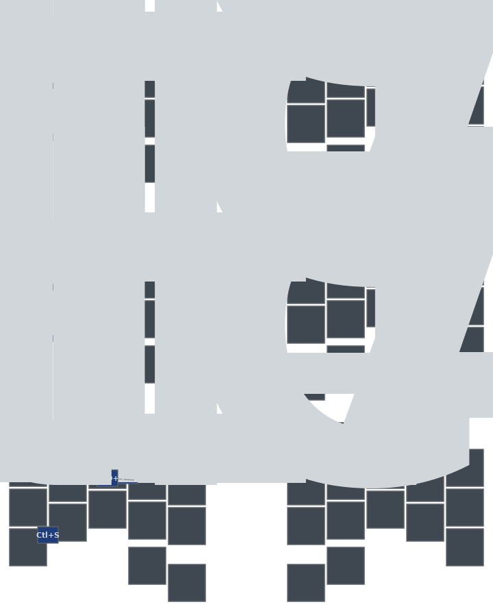
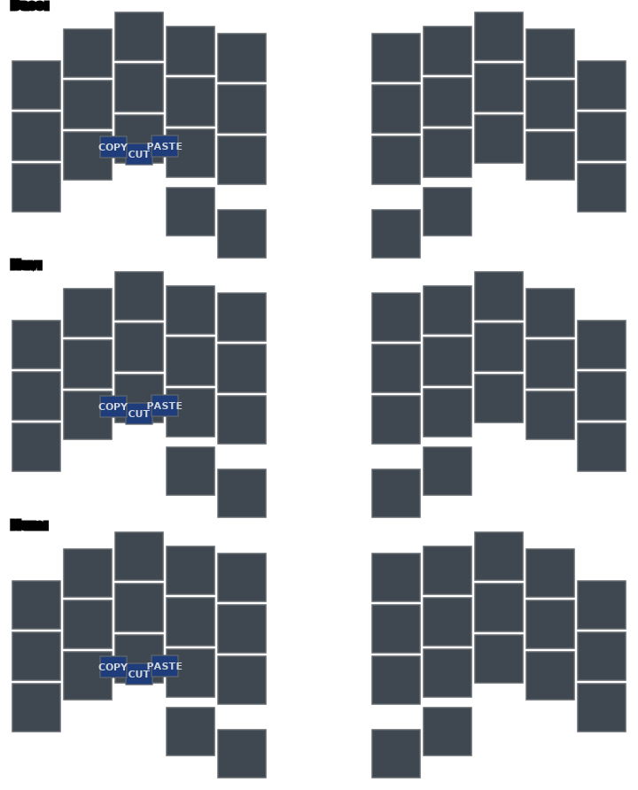
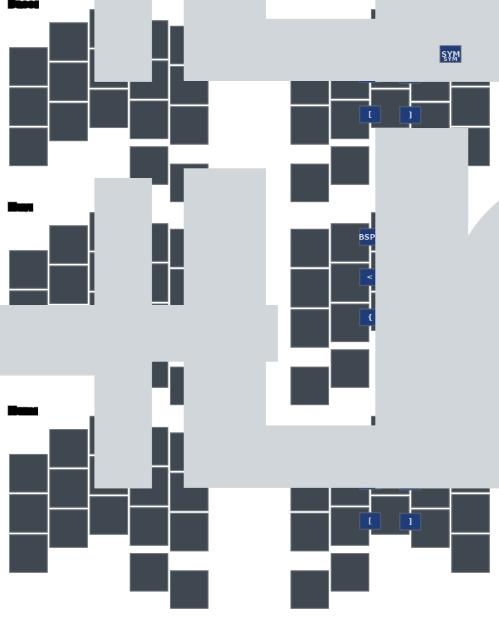
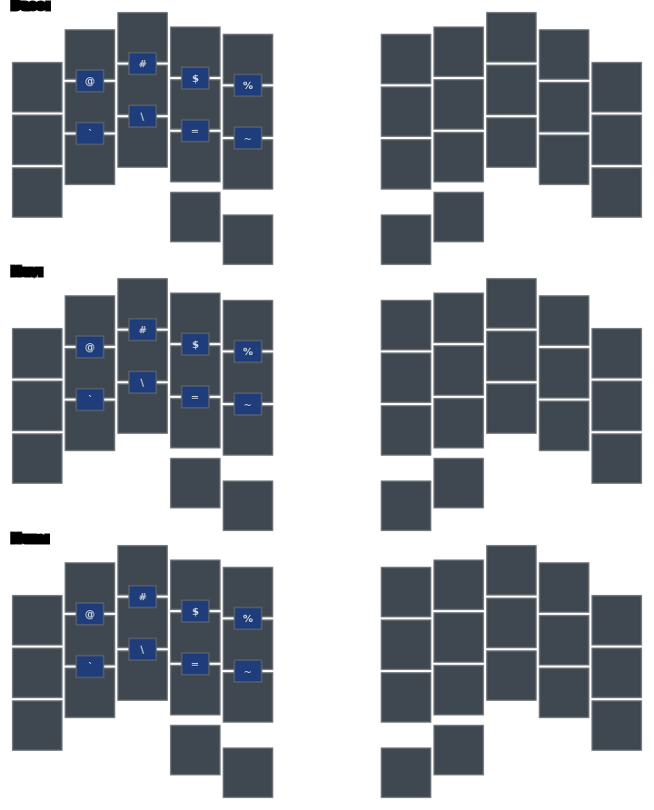
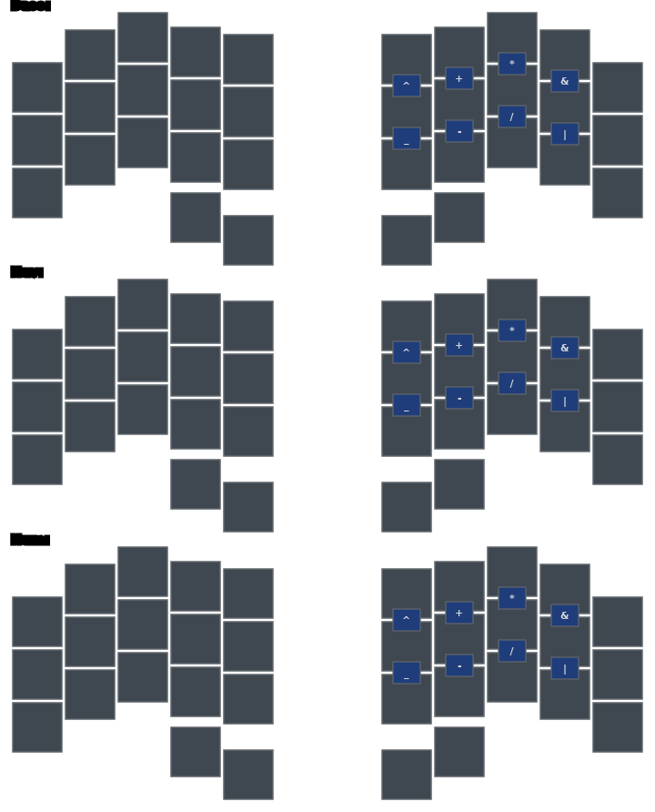

# Combos

A combo sends one output when its listed physical keys are pressed together. Horizontal combos use an 18 ms timeout; vertical symbol combos use 30 ms. Position names follow this map:

```text
╭─────────────────────╮ ╭─────────────────────╮
│ LT4 LT3 LT2 LT1 LT0 │ │ RT0 RT1 RT2 RT3 RT4 │
│ LM4 LM3 LM2 LM1 LM0 │ │ RM0 RM1 RM2 RM3 RM4 │
│ LB4 LB3 LB2 LB1 LB0 │ │ RB0 RB1 RB2 RB3 RB4 │
╰───────────╮ LH1 LH0 │ │ RH0 RH1 ╭───────────╯
            ╰─────────╯ ╰─────────╯
```

## Layer and mode access



| Physical keys | Positions | Output | Layers |
|---|---|---|---|
| W + E | LT3 + LT2 | Escape | Base, Nav, Num |
| E + R | LT2 + LT1 | toggle Mouse | Base, Nav, Num |
| inner thumbs | LH0 + RH0 | Number Word / sticky NUM tap dance | Base, Nav, Num |
| M + `?` | RB3 + RB4 | Number Word | Base |
| O + P | RT3 + RT4 | sticky/momentary SYM | Base |
| three thumbs | LH1 + LH0 + RH0 | momentary SYS | Base |

## Leader and terminal controls



| Physical keys | Positions | Output | Layers |
|---|---|---|---|
| S + D | LM3 + LM2 | Tab | Base, Nav, Num |
| D + F | LM2 + LM1 | Leader | Base, Nav, Num |
| S + D + F | LM3 + LM2 + LM1 | Shifted Leader | Base, Nav, Num |
| Z + X | LB4 + LB3 | Ctrl+S | Base, Nav, Num |

The hold outputs shown on home-row combo labels preserve the same modifiers as the individual home-row keys.

## Clipboard



| Physical keys | Positions | Output | Layers |
|---|---|---|---|
| X + V | LB3 + LB1 | Cut | Base, Nav, Num |
| X + C | LB3 + LB2 | Copy | Base, Nav, Num |
| C + V | LB2 + LB1 | Paste | Base, Nav, Num |

Clipboard output is OS-aware.

## Right-hand editing



| Physical keys | Positions | Base / Num | Nav |
|---|---|---|---|
| U + I | RT1 + RT2 | Backspace | Backspace |
| I + O | RT2 + RT3 | Delete | Delete |
| J + K | RM1 + RM2 | `(`; Shift gives `<` | `<` |
| K + L | RM2 + RM3 | `)`; Shift gives `>` | `>` |
| M + `,` | RB1 + RB2 | `[` | `{` |
| `,` + `.` | RB2 + RB3 | `]` | `}` |

## Left vertical symbols



| Positions | Output | Layers |
|---|---|---|
| LT3 + LM3 | `@` | Base, Nav, Num |
| LT2 + LM2 | `#` | Base, Nav, Num |
| LT1 + LM1 | `$` | Base, Nav, Num |
| LT0 + LM0 | `%` | Base, Nav, Num |
| LM3 + LB3 | `` ` `` | Base, Nav, Num |
| LM2 + LB2 | `\` | Base, Nav, Num |
| LM1 + LB1 | `=` | Base, Nav, Num |
| LM0 + LB0 | `~` | Base, Nav, Num |

## Right vertical symbols



| Positions | Output | Layers |
|---|---|---|
| RT0 + RM0 | `^` | Base, Nav, Num |
| RT1 + RM1 | `+` | Base, Nav, Num |
| RT2 + RM2 | `*` | Base, Nav, Num |
| RT3 + RM3 | `&` | Base, Nav, Num |
| RM0 + RB0 | `_` | Base, Nav, Num |
| RM1 + RB1 | `-` | Base, Nav, Num |
| RM2 + RB2 | `/` | Base, Nav, Num |
| RM3 + RB3 | `|` | Base, Nav, Num |

The keymap contains 39 live combo definitions. The tables above list every one, including layer-specific outputs that reuse the same physical pair.
