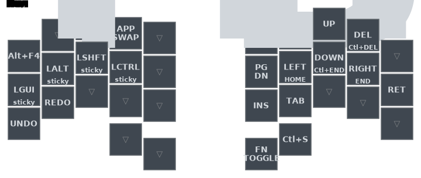
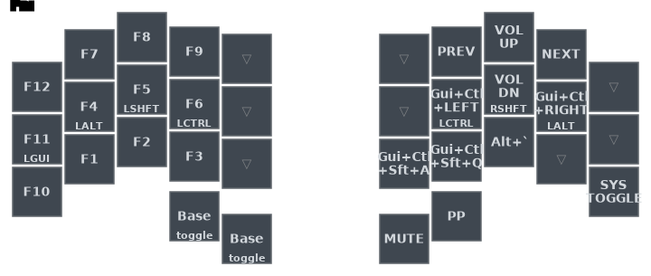
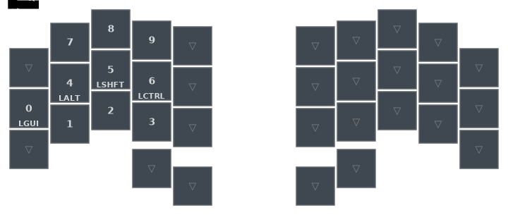
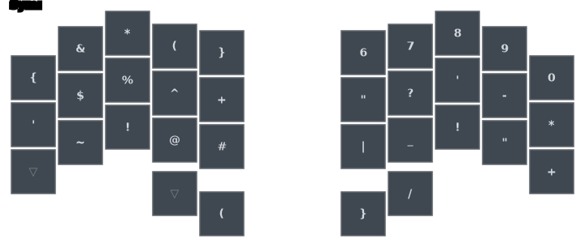
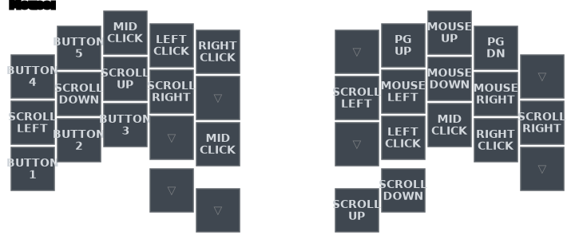
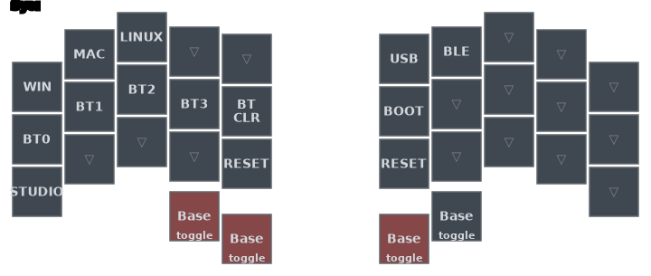

# Zyraft keymap

## Legend

Each diagram is generated from `config/zyraft.keymap`.

| Mark | Meaning |
|---|---|
| center label | tap output |
| lower label | hold output |
| upper-right label | shifted or modified tap |
| `▽` | transparent: use the binding from the next active layer below |
| `TOGGLE` | turn a layer on or off until another binding changes it |
| `sticky` | apply the modifier or layer to the next key |

Key positions used by the combo tables:

```text
╭─────────────────────╮ ╭─────────────────────╮
│ LT4 LT3 LT2 LT1 LT0 │ │ RT0 RT1 RT2 RT3 RT4 │
│ LM4 LM3 LM2 LM1 LM0 │ │ RM0 RM1 RM2 RM3 RM4 │
│ LB4 LB3 LB2 LB1 LB0 │ │ RB0 RB1 RB2 RB3 RB4 │
╰───────────╮ LH1 LH0 │ │ RH0 RH1 ╭───────────╯
            ╰─────────╯ ╰─────────╯
```

## Layer access

| Layer | Access |
|---|---|
| Base | default layer; `&to DEF` returns here |
| Nav | hold the left inner Space thumb |
| Fn | toggle from the Nav right inner thumb |
| Num | hold the right outer Backspace thumb; number-word combos provide temporary numeric input |
| Sym | hold the right inner Return thumb; `O+P` provides sticky/momentary access |
| Mouse | toggle with the `E+R` smart-mouse combo |
| Sys | hold the three-thumb combo; Fn also contains a SYS toggle |

## Base


- Home-row mods use Ctrl, Alt, GUI, Shift from the outside in.
- Left outer thumb handles adaptive repeat, sticky Shift, Caps Word, and held Shift.
- Space is also NAV and double-tap Escape.
- Return is also SYM and double-tap Tab.
- Backspace is also NUM; Shift+tap sends Escape.

## Nav



- Arrow keys become Home/End or document start/end when held.
- Backspace/Delete become word deletion when held.
- `APP SWAP` selects applications using Alt on Windows/Linux and Command on macOS.
- The right inner thumb toggles Fn. The right outer thumb sends `Ctrl+S`.

## Fn



Function keys occupy the left hand. Media, desktop switching, desktop pinning, and the SYS toggle occupy the right hand. Both left thumbs return directly to Base.

## Num



The left hand is a compact numpad with home-row mods preserved. Number Word exits automatically when numeric entry ends; sticky NUM remains active for the next key.

## Sym



Symbols remain available through combos on Base/Nav/Num, while this layer provides a complete visible symbol and number arrangement.

## Mouse



- Left-hand top and bottom rows provide mouse buttons.
- Right-hand home positions move the pointer and scroll horizontally.
- Thumbs scroll vertically.
- NAV scales movement/scrolling up; FN scales them down for finer control.

## Sys



SYS selects the active operating system, Bluetooth profile, USB/BLE output, ZMK Studio, bootloader, and reset. Every thumb returns to Base. Reset and bootloader bindings change device state; use them deliberately.
